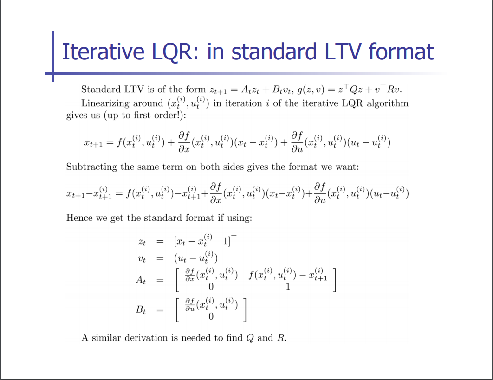
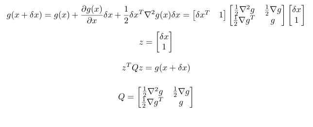
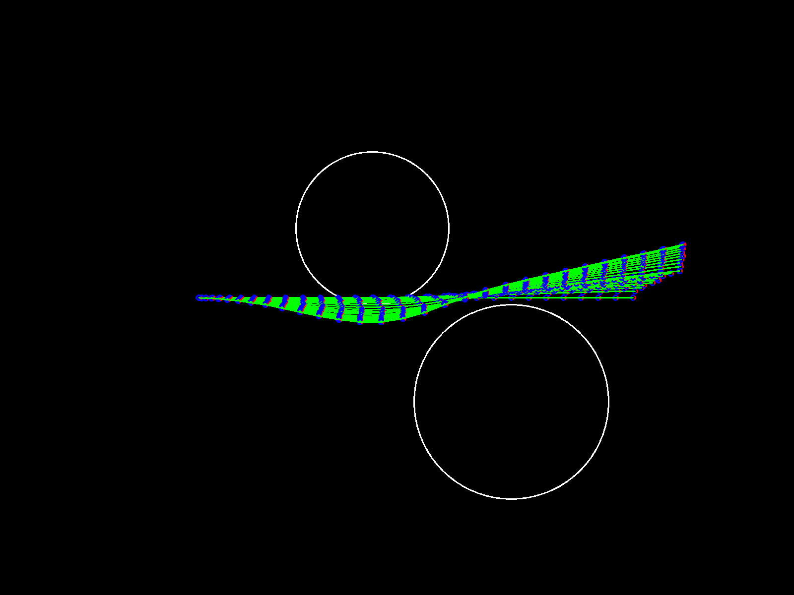

This is an experimental repository for exploring optimization algorithms.

The main algorithm is iterative LQR.

# Setup

Information about how to setup the dev env (on ubuntu).

## Install ProtoBuf
```
sudo apt-get install autoconf automake libtool curl make g++ unzip -y
git clone https://github.com/google/protobuf.git
cd protobuf
git submodule update --init --recursive
./autogen.sh
./configure
make
sudo make install
sudo ldconfig
```

## Install OpenCV

OpenCV was used in this project as visualization tools.
```
sudo apt update
sudo apt install libopencv-dev python3-opencv
```

# Math




Only the trajectory following algorithm was implemented, and I lost interest on this. 

The iterative LQR algorithm should be most interesting, since it optimizes any cost given a initial trajectory. 
But Pratically applying this algorithm will require some good search output, which serves as the initialization.

Reference: 

*  Kinematics model: [Bycicle model](https://borrelli.me.berkeley.edu/pdfpub/IV_KinematicMPC_jason.pdf).
*  LQR: [pabbeel's lecture](https://people.eecs.berkeley.edu/~pabbeel/cs287-fa12/slides/LQR.pdf)

# Results



So the optimizer was able to find a proper trajectory to stay away from the objects. 

The result trajectory deviates from initial trajectory, since we do not have attractor to the original traj, which is expected. 